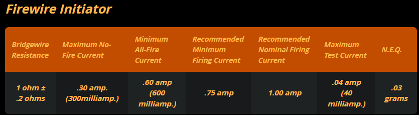
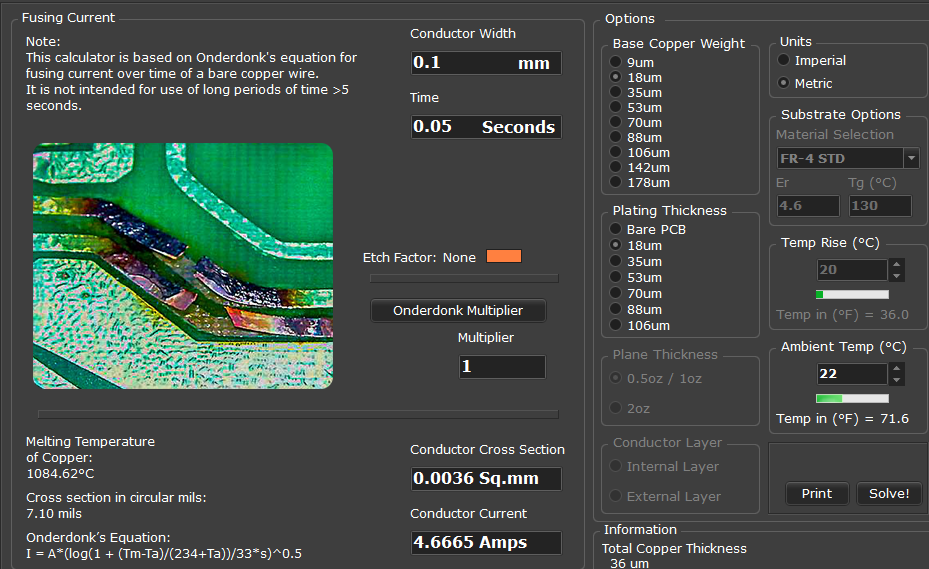

# Ematch-Simulator
A basic resistor and fuse approximation for an ematch for testing without pyrotechnics

The target design specs for the ematch simulator are based on [This](https://electricmatch.com/pyrotechnics/see/6/5/mjg-firewire-initiator--standard).

Target: ~750mA, ~50ms, ~1ohm

Minimum possible PCB trace fuse
