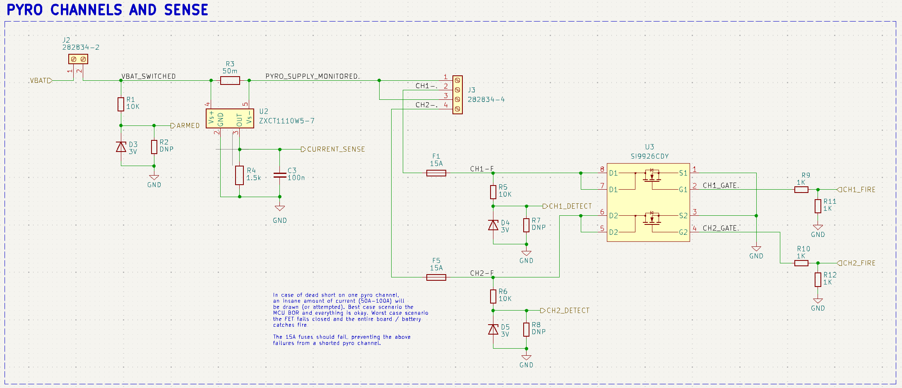
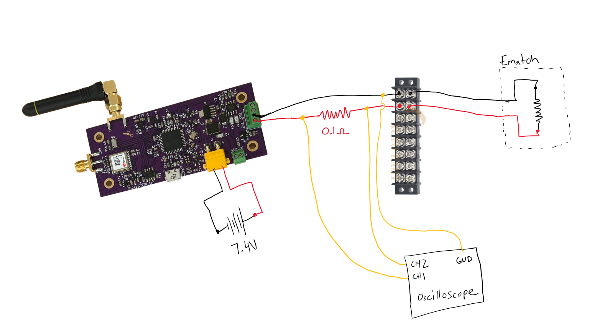
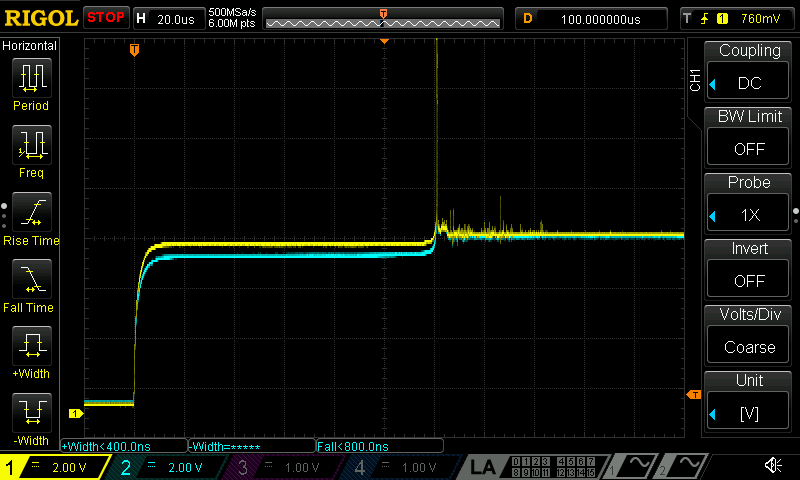
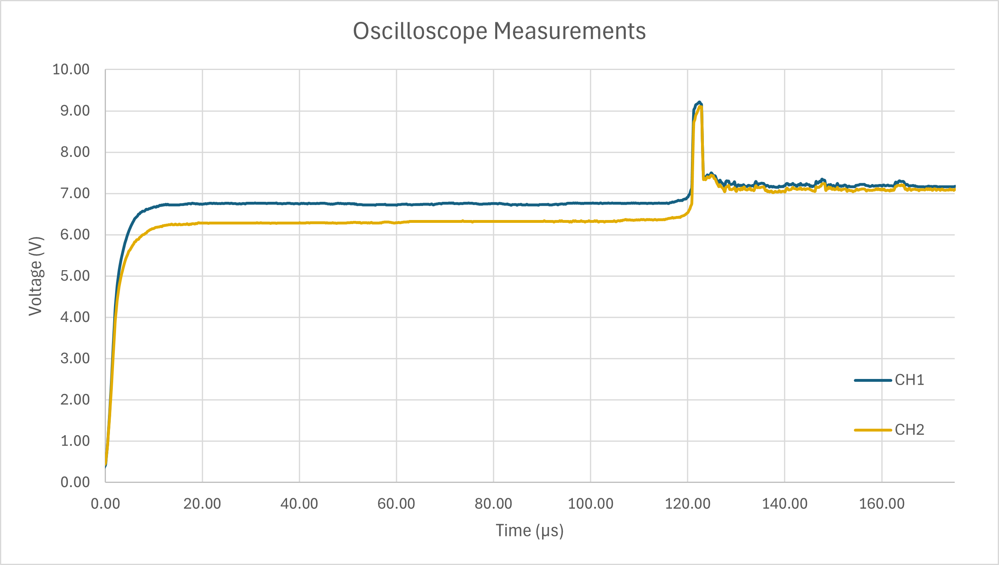
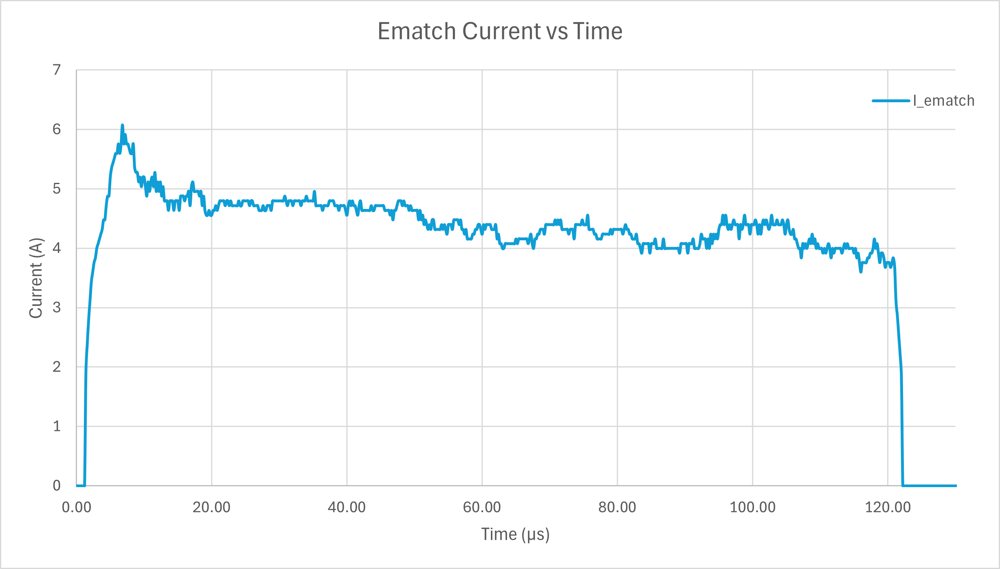
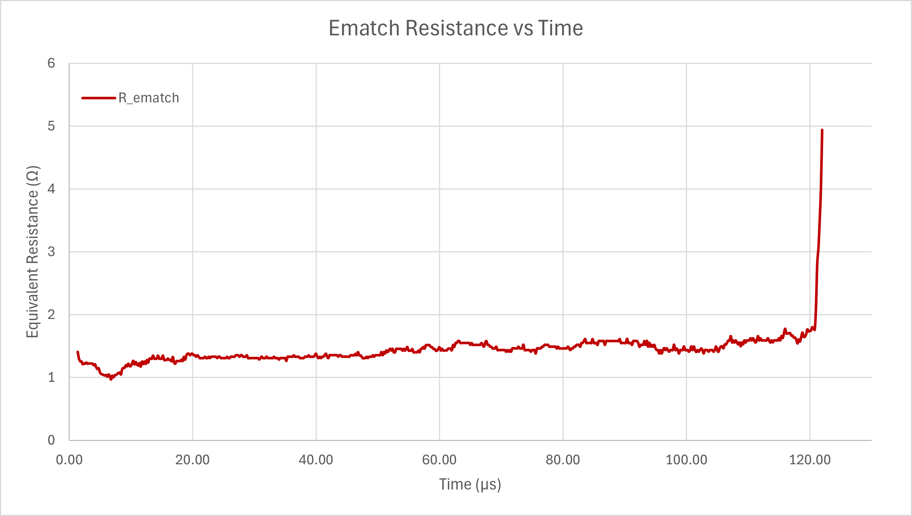

# ematch_measurements
A collection of oscilloscope captures and .csv files for measuring the electrical characteristics of an [MJG ematch](https://electricmatch.com/pyrotechnics/see/6/5/mjg-firewire-initiator--standard). The pyro circuit from the SRAD-FC was utilized to fire the three ematches tested. All ematches were fired using a custom 2S lithium pack created from two 18650s in series (charged to ~7.16V). 

## File Desription
| Image | CSV | Note |
| ----- | --- | ---- |
| 1.bmp | 1.csv | Test #1, very zoomed out |
| 2.bmp | 2.csv | Test #2, very zoomed out |
| 2zoom.bmp | 2zoom.csv | Test #2, zoomed in capture |
| 3.bmp | 3.csv | Test #3, correctly zoomed - best resolution (recommended for analysis) |

**Note: The oscilloscope used to capture the events was later discovered to be on an out of date firmware version. The firmware used had a bug with .csv file exports meaning that all exported .csv files were limited to the screen resolution (1200 data points). This severely reduced the resolution**

## Analysis 
Analysis of Test #3 since it yielded the highest resolution data. 

The above graph was created from the .CSV file exported from Test #3. Unfortunately, the decimation that occured from the firmware bug meant that the vertical and horizontal resolution of the exported data was much lower than it should have been. That greatly contributed to the 'jaggedness' of the plotted graph. To reduce noise, a 10 sample moving average was performed. **Note: The 9V spike that occurs is due to to the inductance of the wires used for constructing the circuit.** When the ematch broke connection, the energy stored in the magnetic field was rapidly converted into a voltage resulting in the large spike. This means that the time of  the spike is indicative of the ematch wire breaking. 

